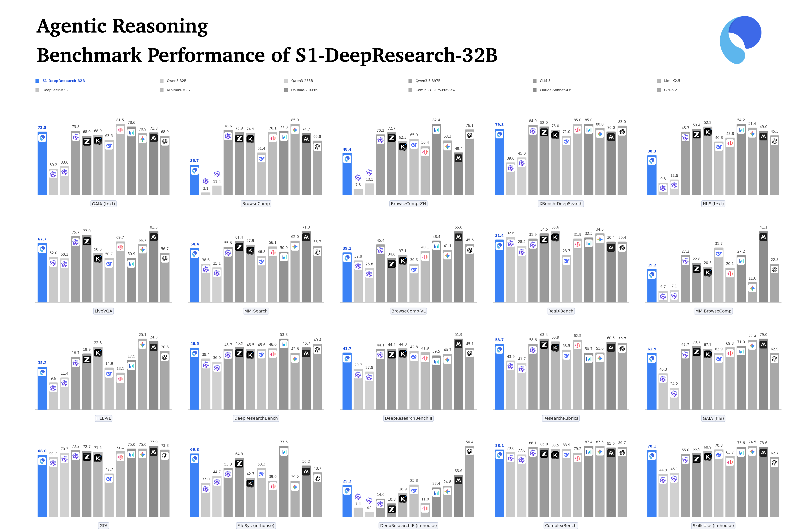
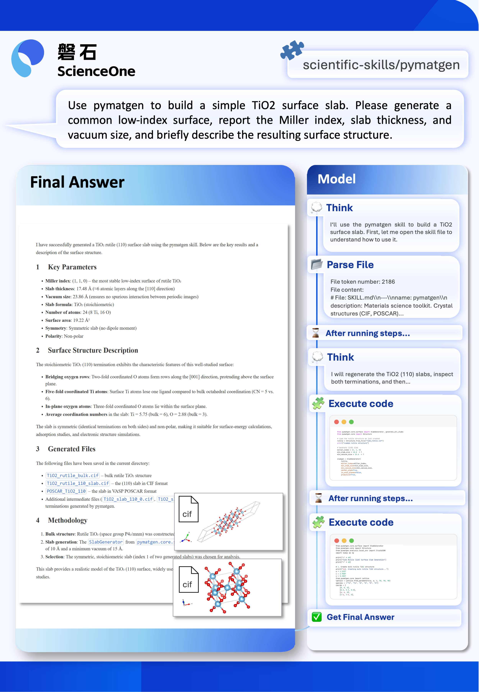

<div align="center">

# S1-DeepResearch：面向长程深度研究的端到端模型

[](./LICENSE)
[](https://huggingface.co/datasets/ScienceOne-AI/S1-DeepResearch-15k)
[](https://huggingface.co/ScienceOne-AI/S1-DeepResearch-32B)
[](https://modelscope.cn/models/ScienceOne-AI/S1-DeepResearch-32B)

[English](./README_en.md) | 中文

</div>

<hr>

## 🔥 最新动态 (News & Updates)

- **[2026/04/04]** 🎉 发布 [**S1-DeepResearch-32B**](https://huggingface.co/ScienceOne-AI/S1-DeepResearch-32B)：面向长程深度研究的端到端旗舰模型，更侧重**真实场景落地**——在**长链复杂推理**之外，重点强化**深度研究指令遵循**、**深度调研报告写作**、**文件理解与生成**、**技能调用**等能力。在 20 项智能体基准能力评测中，相对基座 **Qwen3-32B** 全方位显著领先，整体性能接近主流闭源旗舰模型（**GPT 5.2**、**Claude 4.6**、**GLM-5**）。推理代码及 [15K 智能体训练轨迹数据（开源版本）](https://huggingface.co/datasets/ScienceOne-AI/S1-DeepResearch-15k)同步发布。
- **[2025/12/31]** 我们开源了 [**S1-DeepResearch-8B-Preview**](https://huggingface.co/ScienceOne-AI/S1-DeepResearch-8B-Preview)：聚焦**通用长链路复杂推理**，以轻量参数探索深度研究场景下的可用空间。

## 📝 概述 (Overview)

**S1-DeepResearch-32B** 是磐石团队（ScienceOne AI）研发的面向 **长程深度研究（Long-Horizon Deep Research）** 的端到端模型，其核心能力可概括为 **五大维度**：

- **长链复杂推理**：支持多阶段、多跳任务中的持续推理与行动推进，突破单步问答范式。通过跨文档检索、证据聚合、状态记忆与策略迭代，实现复杂任务中的路径规划、信息整合与结果收敛，确保推理过程的稳定性与结论的可靠性。

- **深度研究指令遵循**：精准解析深度研究场景下的多约束复杂指令，构建围绕「任务定义—方法机理—工具执行—结果呈现」等深度研究全链路的指令理解范式；并在认知、产物、执行与环境四层上协同约束，让复杂任务可控、过程可预期、结果与意图一致。

- **深度调研报告写作**：在信息整合之上输出可论证、可引用的报告体例；支持多源材料组织与证据核对，兼顾论述结构、可读性与事实可追溯，直接服务科研写作与决策研判。

- **文件理解与生成**：覆盖 PDF、表格、网页等多形态输入的理解，以及结构化、可交付的输出生成。在多轮工具增强交互中尽量保持语义与执行一致，形成「解析—加工—生成」的闭环，减轻科研与数据密集型流程中的重复手工环节。

- **技能使用（Skills）**：将文献检索、数据分析、实验设计、计算建模、可视化与报告生成等以可调用模块形式组织，按任务目标进行动态装配与渐进式加载，支撑从数据获取到结果呈现的连续工作流。

### ✨ 核心特性

- **超长上下文建模**：支持 128K 上下文窗口，单会话承载更长证据链与多轮交互历史，适配长程研究任务。
- **长程工具调用**：可稳定执行 **150+** 轮连续工具调用，构建基于推理驱动的工具编排与决策闭环，实现多阶段任务的持续规划、执行与自我校正。
- **原生工具体系**：内置 **9** 种常用工具（如搜索、网页浏览、代码执行、命令行等），开箱即用。

## 🚀 模型下载 (Model Download)

<div align="center">

| 模型名称 | 参数量 | 上下文长度 | 下载链接 |
| :---: | :---: | :---: | :---: |
| **S1-DeepResearch-32B** | 32B | 128k | [🤗 HuggingFace](https://huggingface.co/ScienceOne-AI/S1-DeepResearch-32B) \| [🤖 ModelScope](https://modelscope.cn/models/ScienceOne-AI/S1-DeepResearch-32B) |
| **S1-DeepResearch-8B-Preview** | 8B | 128k | [🤗 HuggingFace](https://huggingface.co/ScienceOne-AI/S1-DeepResearch-8B-Preview) \| [🤖 ModelScope](https://modelscope.cn/models/ScienceOne-AI/S1-DeepResearch-8B-Preview) |

</div>

## 📊 性能评估 (Evaluation)

我们在与模型 **五大能力** 相对应的 **5 个维度、共 20 项智能体能力基准** 上对 **S1-DeepResearch-32B** 进行了系统评估，各维度与基准对应关系如下：

- **长链复杂推理**：文本模态包括 GAIA (text)、BrowseComp、BrowseComp-ZH、XBench-DeepSearch、HLE (text)；图文模态包括 LiveVQA、MM-Search、BrowseComp-VL、RealX-Bench、HLE-VL、MM-BrowseComp。
- **深度研究指令遵循**：ComplexBench、DeepResearchIF (in-house)。
- **深度调研报告写作**：DeepResearch Bench、DeepResearch Bench II、Research Rubrics。
- **文件理解与生成**：GAIA (file)、GTA、FileSys (in-house)。
- **技能调用**：SkillsUse (in-house)。

<div align="center">



</div>

**S1-DeepResearch-32B** 在所有榜单上相对基座 **Qwen3-32B** 及更大参数量模型 **Qwen3-235B** 均取得显著优势；在深度研究指令遵循、文件理解与生成、技能调用等维度的内部榜单中，亦超越 **Qwen3.5-397B**。整体性能接近主流闭源旗舰（**GPT 5.2**、**Claude 4.6**、**GLM-5**、**Kimi-K2.5**）。开放榜单与内部任务的结果相互印证，表明 S1-DeepResearch-32B 已具备面向真实业务场景部署与落地的能力。

## 📂 任务样例 (Cases)

以下展示 S1-DeepResearch-32B 在技能调用方面的案例，模型在进行材料建模的过程中，首先调用了科学技能`scientific-skills/pymatgen`补充专业知识，然后根据技能的指导，使用`pymatgen`完成建模，并输出cif文件。

<div align="center">



</div>

更多案例将持续补充至 `cases/` 目录。

## 🚀 快速开始

### 环境配置

1. **安装依赖**：

```bash
pip install -r requirements.txt
```

2. **Docker 配置**:

项目提供官方预构建 Docker 镜像，支持快速部署与运行。系统包含两个核心镜像：

- **toolkits-api**：工具服务主容器（对外提供 API 能力）
- **code-sandbox**：代码执行沙箱镜像（由服务按需创建，用于隔离执行任务）

当前执行类工具（`execute_code`、`bash`）采用 **Docker-outside-of-Docker（DooD）** 模式：通过挂载宿主机 Docker socket，由工具容器直接调用宿主机 Docker daemon，按需创建隔离的沙箱容器执行任务。

**镜像地址:**

```text
ghcr.io/wenge-research/toolkits-api:v2.0.260403
ghcr.io/wenge-research/code-sandbox:v1.0.260403
```

**拉取镜像:**

```text
docker pull ghcr.io/wenge-research/toolkits-api:v2.0.260403
docker pull ghcr.io/wenge-research/code-sandbox:v1.0.260403
```

**运行容器:**

运行容器时需要挂载配置文件 `src/config.yaml`、Docker socket（用于沙箱执行），以及日志和缓存目录（可选）：

```bash
docker run -d \
  --name toolkits-api \
  --network host \
  -e API_PORT=8080 \
  -e API_WORKERS=4 \
  -e HOST_LOG_DIR=$(pwd)/logs \
  -e SANDBOX_MODE=docker \
  -e HTTP_PROXY=http://your-proxy:port \
  -e HTTPS_PROXY=http://your-proxy:port \
  -e PROXY_URL=http://your-proxy:port \
  -v /etc/localtime:/etc/localtime:ro \
  -v /etc/timezone:/etc/timezone:ro \
  -v /var/run/docker.sock:/var/run/docker.sock \
  -v $(pwd)/src/config.yaml:/app/src/config.yaml \
  -v $(pwd)/logs:/app/logs \
  -v $(pwd)/cache:/app/cache \
  ghcr.io/wenge-research/toolkits-api:v2.0.260403
```

**参数说明**：

| 参数 | 说明 |
|------|------|
| `-e API_PORT` | 服务监听端口，默认 8080 |
| `-e API_WORKERS` | worker 进程数，根据并发需求调整，默认 1 |
| `-e SANDBOX_MODE=docker` | 启用 Docker 沙箱模式（否则为 subprocess） |
| `-e HOST_LOG_DIR` | 当启用 Docker 沙箱模式时，需要传入宿主机日志目录，供沙箱容器挂载 |
| `-e HTTP_PROXY / HTTPS_PROXY / PROXY_URL` | 代理配置（可选） |
| `--network host` | 如果使用宿主机的代理端口，需要设置此参数（可选） |
| `-v /etc/localtime:/etc/localtime:ro` | 同步宿主机时区（只读） |
| `-v /etc/timezone:/etc/timezone:ro` | 同步宿主机时区文件（只读） |
| `-v /var/run/docker.sock` | 当启用 Docker 沙箱模式时，需要挂载宿主机 Docker socket，用于调度沙箱容器 |
| `-v config.yaml` | 挂载配置文件（API Key、模型配置、沙箱配置等） |
| `-v logs` | 挂载日志目录（可选） |
| `-v cache` | 挂载缓存目录，缓存数据形式参考容器内 /app/cache 中文件进行构造（可选） |


3. **配置工具服务地址**

推荐通过 JSON 配置文件或环境变量覆盖默认项。不建议直接编辑 `utils/configs.py`。

**方式一（推荐）：本地 JSON 配置**

从示例文件复制并生成本地配置：

```bash
cp utils/config/config.example.json utils/config/config.local.json
```

在 `utils/config/config.local.json` 中设置工具服务基地址，例如：

```json
{
  "TOOLS_SERVER_BASE_ENDPOINT_URL": [
    "http://127.0.0.1:8080"
  ]
}
```

**方式二：环境变量**

指定配置文件路径，或对单项进行覆盖：

```bash
export S1_DR_CONFIG_JSON="utils/config/config.local.json"
# 或仅覆盖 TOOLS_SERVER_BASE_ENDPOINT_URL
export TOOLS_SERVER_BASE_ENDPOINT_URL='["http://127.0.0.1:8080"]'
```

4. **配置 API 密钥**

建议通过 `utils/config/config.local.json` 配置各服务商密钥，或覆盖同名环境变量：

```json
{
  "AIHUBMIX_KEY": "<your_aihubmix_key>",
  "AZURE_KEY": "<your_azure_key>",
  "VOLCANO_KEY": "<your_volcano_key>",
  "ALIYUN_KEY": "<your_aliyun_key>"
}
```

环境变量示例：

```bash
export AIHUBMIX_KEY="<your_aihubmix_key>"
export AZURE_KEY="<your_azure_key>"
export VOLCANO_KEY="<your_volcano_key>"
export ALIYUN_KEY="<your_aliyun_key>"
```

### 单条推理示例

```python
import asyncio

from server.llm_api import LLMClient
from server.tool_api import return_all_tools
from inference.run_single_inference import run_one_query
from utils.prompts import DEEPRESEARCH_SYSTEM_PROMPT


async def main():
    llm_client_urls = ["http://127.0.0.1:10777/v1/chat/completions"]
    llm_client_models = ["S1-DeepResearch-32B"]
    llm_client = LLMClient(llm_client_urls, llm_client_models)

    all_tools = return_all_tools()

    result = await run_one_query(
        llm=llm_client,
        user_query="阿里巴巴成立时，18位创始团队成员中，姓马、姓蔡、姓张的创始人的平均年龄，保留一位小数",
        file_path=[],
        system=DEEPRESEARCH_SYSTEM_PROMPT,
        max_rounds=15,
        temperature=0.4,
        top_p=0.95,
        extra_payload={},
        debug=True,
        all_tools=all_tools,
        system_format="deep_research",
        log_label="quick_start_single",
    )

    final_answer = result[-1]["final_answer"] if result else ""
    print(final_answer)


if __name__ == "__main__":
    asyncio.run(main())
```

说明：

- `file_path` 在当前实现中应传 `list`（如 `[]` 或 `['/path/a.pdf']`）。
- `system_format` 可选：`deep_research`、`azure`、`aihubmix`、`aihubmix_claude`、`aihubmix_glm`、`volcano`、`aliyun`。

### 批量推理示例

本地/vLLM：

```bash
cd inference
cp run_batch_inference_demo.sh run_batch_local.sh
# 编辑 run_batch_local.sh 里的参数（LLM_CLIENT_URLS、LLM_CLIENT_MODELS、TEST_DATA_FILE 等）
bash run_batch_local.sh
```

在线平台：

```bash
cd inference
cp run_batch_inference_online_demo.sh run_batch_online.sh
# 编辑 run_batch_online.sh 里的参数（LLM_CLIENT_URLS、LLM_CLIENT_MODELS、SYSTEM_FORMAT 等）
bash run_batch_online.sh
```

日志查看：

```bash
tail -f run_logs/*.log
```

更多推理功能详见 📖 **[进阶使用方法](./inference/README.md)**。

## 🔭 未来工作 (Future Work)

- **S1-DeepResearch 论文：** 预计两周内发布S1-DeepResearch论文，详细介绍支撑 S1-DeepResearch 五大能力特性的数据合成策略、模型训练与推理机制设计，以及推理时扩展等关键评测结论与实践经验。
- **S1-DeepResearch-VL 版本：** 2026年上半年，将推出支持视觉理解与跨模态推理的 S1-DeepResearch-VL 模型，以覆盖更丰富的研究型任务场景。

## 📜 协议 (License)

本项目采用 **[Apache License 2.0](./LICENSE)** 开源协议。

## 引用 (Citation)

如果您觉得 S1-DeepResearch 对您的工作有帮助，请考虑引用我们的工作：

```bibtex
@software{s1deepresearch2026,
    title={S1-DeepResearch: End-to-End Deep Research Models},
    author={ScienceOne Team},
    year={2026},
    url={https://github.com/ScienceOne-AI/S1-DeepResearch},
}
```
