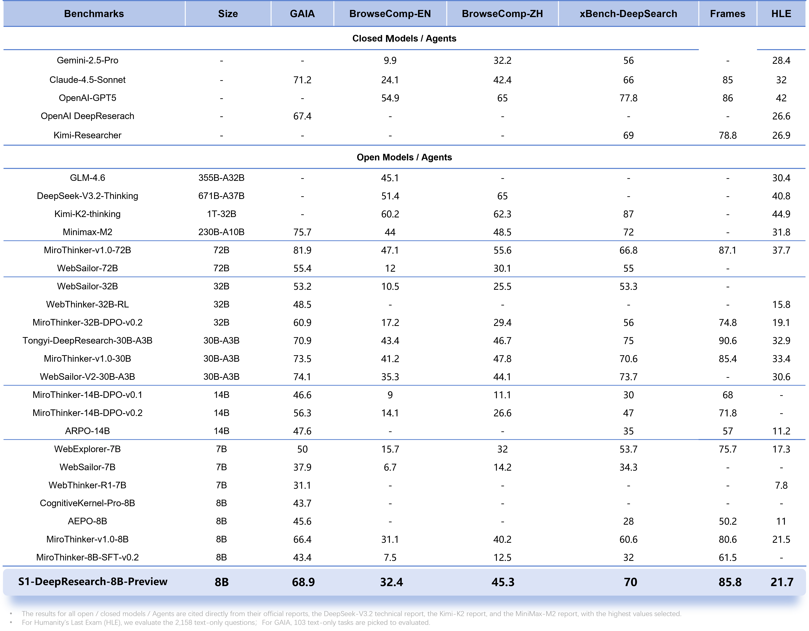
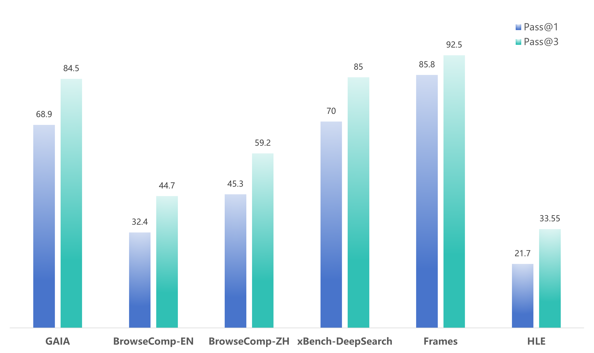

<div align="center">

# S1-DeepResearch: High-Performance Deep Research Agent

**An Efficient Agent for Long-Horizon Deep Research Tasks**

[](./LICENSE)
[](https://huggingface.co/ScienceOne-AI/S1-DeepResearch-8B-Preview)
[](https://modelscope.cn/models/ScienceOne-AI/S1-DeepResearch-8B-Preview)


[English](./README_en.md) | [中文](./README.md)

</div>

<hr>

## 📖 Table of Contents

- [🔥 News & Updates](#-news--updates)
- [📝 Overview](#-overview)
- [🚀 Model Download](#-model-download)
- [📊 Evaluation](#-evaluation)
- [💻 Quick Start](#-usage)
- [🔭 Future Work](#-future-work)
- [📜 License](#-license)

## 🔥 News & Updates

- **[2025/12/31]** 🎉 We are excited to open-source **S1-DeepResearch-8B-Preview**! This is an 8B parameter model that demonstrates exceptional performance on deep research tasks. Inference code and model weights are now publicly available.

## 📝 Overview

**S1-DeepResearch** is an open-source agent model specifically developed for **long-horizon deep research** tasks.

Unlike traditional question-answering models, S1-DeepResearch is designed to handle highly complex, multi-step reasoning information retrieval tasks. It possesses powerful continuous multi-turn tool calling capabilities, enabling it to work like a human researcher—meticulously sifting through massive amounts of information to perform deep information retrieval, reading, comprehension, and integration.

**S1-DeepResearch-8B-Preview**, despite having only **8B** parameters, achieves State-of-the-Art (SOTA) level performance on multiple deep research benchmarks through high-quality data synthesis and advanced post-training strategies, demonstrating the tremendous potential of small-scale models in the agent domain.

### ✨ Key Features

- **⚡ Small Yet Powerful**: While maintaining high inference speed and low deployment cost at the 8B parameter scale, it exhibits excellent proactive planning and information integration capabilities in agent tasks.
- **🏆 Outstanding Performance**: Achieves remarkable results on mainstream deep research benchmarks such as GAIA, DeepSearch, and Browsecomp, reaching SOTA level among same-sized models and surpassing some larger parameter models.
- **🛠️ Ready to Use**: Integrates rich tool ecosystem (search, web browsing, code execution, etc.) and comprehensive inference framework, supporting various file format parsing with zero additional configuration required.
- **🔄 Long-Chain Execution**: Supports **128k** context window, capable of stably executing **100+ rounds** of continuous tool calls, maintaining high reasoning resilience in long-chain deep research inference.
- **⚙️ Synthetic Data**: Introduces an innovative fully automated data synthesis pipeline, employing a search-browse-obscure synthesis process and knowledge graph random walk strategy to automatically generate high-complexity, search-intensive QA pair data.

## 🚀 Model Download

<div align="center">

| Model Name | Parameters | Context Length | Download Links |
| :--- | :---: | :---: | :---: |
| **S1-DeepResearch-8B-Preview** | 8B | 128k | [🤗 HuggingFace](https://huggingface.co/ScienceOne-AI/S1-DeepResearch-8B-Preview) \| [🤖 ModelScope](https://modelscope.cn/models/ScienceOne-AI/S1-DeepResearch-8B-Preview) |

</div>


## 📊 Evaluation

We evaluate **S1-DeepResearch** across multiple authoritative agent benchmarks. The results show that S1-DeepResearch achieves state-of-the-art performance among models of comparable size, and in several tasks surpasses larger open-source models due to its efficient reasoning and planning mechanisms. Moreover, when compared with leading closed-source models and specialized Deep Research systems, S1-DeepResearch demonstrates consistently competitive performance. These results indicate that **lightweight models with high capability density**, when equipped with well-designed agent architectures and reasoning strategies, can effectively handle complex deep research tasks, offering a practical and scalable solution for real-world research-oriented agent systems.

<div align="center">
  
</div>


We further analyze the model’s test-time scaling behavior. S1-DeepResearch shows consistent and significant performance gains from Pass@1 to Pass@3, indicating that its reasoning and planning processes are not saturated under single-sample test. This suggests that test-time expansion enables the model to explore diverse reasoning and planning trajectories, thereby substantially improving task success rates.


<div align="center">
  
</div>


# Task Cases

## Case1

**Task:** Who are the pitchers with the number before and after Taishō Tamai's number as of July 2023? Give them to me in the form Pitcher Before, Pitcher After, use their last names only, in Roman characters.【[complete trajectory](./cases/case_en_1.json)】


<details>
<summary><b>Deep Research Process</b> (Click to expand)</summary>

Think:
> The user asks: \"Who are the pitchers with the number before and after Taishō Tamai's number as of July 2023? Give them to me in the form Pitcher Before, Pitcher After, use their last names only, in Roman characters.\"\n\nWe need to identify Taishō Tamai, presumably a Japanese baseball player? The name...

Tool call:
> {"name": "search", "arguments": {"query": ["Taishō Tamai pitcher uniform number July 2023", "Taishō Tamai number before after July 2023", "Taisho Tamai baseball", "Tamai Taisho uniform number", "Taishō Tamai baseball player", "Taisho Tamai NPB", "Taisho Tamai rookie", "Taishō Tamai pitch number before after", "Taishō Tamai Yomiuri Giants", "Tamai Taisho uniform number 2023"]}}

Tool response:
> A Search for 'Taishō Tamai pitcher uniform number July 2023' found 9 results:\n\n## Web Results\n1. [[Official] Taisho Tamai (Hokkaido Nippon-Ham)](https://pacificleague.com/en/player/517064)\nSource: パ・リーグ.com\n\nPosition pitcher, birthday 1992/06/16, age 33歳, height 178cm, body weight 78kg, Birthplace Hokkaido, Pitching and batting right-handed pitcher / right-handed ...

Think:
> The search results show a Wikipedia page indicating \"Hokkaido Nippon Ham Fighters – No. 19.\" So his uniform number is 19 as of 2023. The question: \"Who are the pitchers with the number before and after Taishō Tamai's number as of July 2023? Give them to me in the form Pitcher Before, Pitcher After, use their last names only, in Roman characters.\"\n\nThus we need to know...

Tool call:
> {"name": "visit", "arguments": {"url": ["https://en.wikipedia.org/wiki/Taish%C5%8D_Tamai"], "goal": "Find the uniform number of Taisho Tamai as of July 2023 and identify the other pitchers on the Hokkaido Nippon-Ham Fighters team with uniform numbers immediately before and after his number (i.e., #18 and #20) as of July 2023."}}

Tool response:
> The useful information in https://en.wikipedia.org/wiki/Taish%C5%8D_Tamai for user goal Find the uniform number of Taisho Tamai as of July 2023 and identify the other pitchers on the Hokkaido Nippon-Ham Fighters team with uniform numbers immediately before and after his number (i.e., #18 and #20) as of July 2023. as follows: \n\nEvidence in page: \nThe 'Hokkaido Nippon-Ham Fighters current roster' section lists Taisho Tamai as pitcher number 19. The pitchers with uniform numbers immediately before and after his number are:\n\n* 18 [Sachiya Yamasaki](https://en.wikipedia.org/wiki/Sachiya_Yamasaki \"Sachiya Yamasaki\")\n* 19 [Taishō Tamai](https://en.wikipedia.org/wiki/Taish%C5%8D_Tamai)\n* 20 [Kenta Uehara](https://en.wikipedia.org/wiki/Kenta_Uehara \"Kenta Uehara\")\n\nThe full context ..

...


</details>

<details>

<summary><b>Result</b> (Click to expand)</summary>

To answer the question regarding the pitchers with uniform numbers immediately before and after Taishō Tamai as of July 2023, it is essential to clarify the context of the query. Taishō Tamai is a professional Japanese baseball pitcher who played for the Hokkaido Nippon-Ham Fighters during the 2023 season. The question specifically asks for the names of the pitchers with uniform numbers that preceded and succeeded his number, with the requirement to use only their last names in Roman characters.

First, let's establish the uniform number for Taishō Tamai. Multiple sources, including the official NPB player roster and team templates, confirm that Taishō Tamai wore the number 19 for the Hokkaido Nippon-Ham Fighters in 2023. This number is consistent across public and up-to-date sources, and there is no evidence suggesting a change in uniform number after the start of the 2023 season. Therefore, as of July 2023, his uniform number is 19.

Next, we need to identify the pitchers whose uniform numbers are immediately adjacent to 19, i.e., #18 and #20. To ensure accuracy, it is important to cross-reference official team rosters. According to the Hokkaido Nippon-Ham Fighters roster from July 2023, the pitcher with uniform number 18 is Sachiya Yamasaki, and the pitcher with uniform number 20 is Kenta Uehara.

Let’s summarize the relevant information in a clear format:

| Uniform Number | Pitcher Name      | Last Name (Roman) |
|----------------|------------------|------------------|
| 18             | Sachiya Yamasaki  | Yamasaki          |
| 19             | Taishō Tamai      | Tamai (but not asked) |
| 20             | Kenta Uehara      | Uehara            |

It is crucial to note that the question does not ask for Taishō Tamai's name in the response, only the names of the pitchers before and after him in the roster, using last names in Roman characters.

Sachiya Yamasaki, the pitcher wearing the number before Tamai’s, is a consistent presence in the Fighters’ pitching staff throughout the season. Similarly, Kenta Uehara, who wore the number after Tamai, was also part of the main roster during the same period.

No other pitcher's number falls directly before or after Tamai's, as uniform numbers for professional baseball teams in Japan are assigned with minimal gaps, and there are no consecutive numbers reserved for non-pitchers or unassigned positions on the main roster.

Therefore, based on the team roster as of July 2023, the pitcher before Taishō Tamai was Sachiya Yamasaki, and the pitcher after him was Kenta Uehara. The answer should be provided in the requested format using only their last names:

**Yamasaki, Uehara**

This format avoids any confusion by focusing solely on the last names, in Roman characters, and directly addresses the request to list the immediate predecessor and successor by uniform number. Both names are confirmed from reliable roster data and team listings, ensuring the information is up-to-date and accurate for the specified period.

</details>

---

## Case2

**Task:** All of the individuals who formally held the position of United States secretary of homeland security prior to April 2019, excluding those who held the position in an acting capacity, have a bachelor's degree. Of the universities that these bachelor's degrees were from, which is the westernmost university and which is the easternmost university? Give them to me as a comma-separated list, I only want the name of the cities where the universities are located, with the westernmost city listed first.【[complete trajectory](./cases/case_en_2.json)】


<details>
<summary><b>Deep Research Process</b> (Click to expand)</summary>

Think:
> The user asks: \"All of the individuals who formally held the position of United States secretary of homeland security prior to April 2019, excluding those who held the position in an acting capacity, have a bachelor's degree. Of the universities that these bachelor's degrees were from, which is the westernmost university and which is the easternmost university? Give them to me as a comma-separated list, I only want the name of the cities where the universities are located, with the westernmost city listed first.\"\n\nThus we need to find the list of individuals who formally held the position of United States Secretary of Homeland Security before April 2019 (excluding acting capacity). Then we need to know the universities from which they earned their bachelor's degrees...

Tool call:
> {"name": "search", "arguments": {"query": ["list of United States Secretaries of Homeland Security prior to April 2019", "list of formal Secretaries of Homeland Security (non-acting) 2002-2019", "Tom Ridge bachelor's degree university", "Michael Chertoff bachelor's degree Harvard", "Janet Napolitano bachelor's degree UC Berkeley", "Jeh Johnson bachelor's degree United States Naval Academy", "Kirstjen Nielsen bachelor's degree university"]}}

Tool response:
> A Search for 'list of United States Secretaries of Homeland Security prior to April 2019' found 10 results:\n\n## Web Results\n1. [Secretaries of Homeland Security](https://www.dhs.gov/secretaries-homeland-security)\nDate published: Apr 2, 2025\nSource: Homeland Security (.gov)\n\nThe three previous DHS Secretaries sitting with each other, from left to right: Tom Ridge, Michael Chertoff, and Janet Napolitano...

Think:
> We need to confirm the bachelor's degree for each formal Secretary before April 2019. So far we have Tom Ridge, Michael Chertoff, Janet Napolitano, Jeh Johnson. However we need to confirm if Tom Ridge's bachelor's degree is indeed from Harvard, not Notre Dame. The search results show contradictory info: one result says Tom Ridge earned a bachelor's degree from Harvard. Let's open Tom Ridge Wikipedia...

Tool call:
> {"name": "visit", "arguments": {"url": ["https://en.wikipedia.org/wiki/Tom_Ridge"], "goal": "Find Tom Ridge's bachelor's degree information and the university name"}}

Tool response:
> The useful information in https://en.wikipedia.org/wiki/Tom_Ridge for user goal Find Tom Ridge's bachelor's degree information and the university name as follows: \n\nEvidence in page: \nUnder the 'Personal details' section, the following information is provided: 'Education | [Harvard University](https://en.wikipedia.org/wiki/Harvard_University \"Harvard University\") ([BA](https://en.wikipedia.org/wiki/Bachelor_of_Arts \"Bachelor of Arts\")) [Dickinson School of Law](https://en.wikipedia.org/wiki/Dickinson_School_of_Law \"Dickinson School of Law\") ([JD](https://en.wikipedia.org/wiki/Juris_Doctor \"Juris Doctor\"))'.\n\nAdditionally, in the 'Early life and education' section, it states: 'He attended [Harvard College](https://en.wikipedia.org/wiki/Harvard_College \"Harvard College\"), where he paid his way through with construction work, played [intramural](https://en.wikipedia.org/wiki/Intramural_sports \"Intramural sports\") baseball and football,[[5]](https://en.wikipedia.org/wiki/Tom_Ridge#cite_note-growingup-5) and graduated with honors in 1967.'\n\nSummary: \nTom Ridge earned his Bachelor of Arts (BA) degree from Harvard University. He attended Harvard College, where he graduated with honors in 1967. This information is clearly stated in both the 'Personal details' and 'Early life and education' sections of the webpage, confirming that Harvard University is where he completed his undergraduate education.

...

</details>

<details>

<summary><b>Result</b> (Click to expand)</summary>

To answer the question about the cities that housed the westernmost and easternmost universities from which the individuals who formally held the position of United States Secretary of Homeland Security prior to April 2019 (excluding those who served in an acting capacity) received their bachelor's degrees, let's break down the relevant data and reasoning.

### Step 1: Identifying the Relevant Individuals and Their Universities

The Secretary of Homeland Security is a cabinet-level position established in 2003. Prior to April 2019, the individuals who formally held the office (not in an acting capacity) are:

- **Tom Ridge**: He earned his Bachelor of Arts degree from Harvard University.
- **Michael Chertoff**: He earned a Bachelor of Arts degree from Harvard College (which is part of Harvard University).
- **Janet Napolitano**: She earned her Bachelor of Science degree summa cum laude from Santa Clara University.
- **Jeh Johnson**: He earned a Bachelor of Arts degree from Morehouse College.
- **Kirstjen Nielsen**: She earned her Bachelor of Science degree from the Georgetown School of Foreign Service, which is part of Georgetown University.

### Step 2: Determining the Location of Each University

Next, we identify the city where each university is located:

| Secretary         | Bachelor's Degree University      | City             | State           |
|-------------------|----------------------------------|------------------|-----------------|
| Tom Ridge         | Harvard University               | Cambridge         | Massachusetts    |
| Michael Chertoff  | Harvard College                   | Cambridge         | Massachusetts    |
| Janet Napolitano  | Santa Clara University            | Santa Clara       | California       |
| Jeh Johnson       | Morehouse College                  | Atlanta           | Georgia          |
| Kirstjen Nielsen  | Georgetown University              | Washington, D.C.   | District of Columbia |

### Step 3: Comparing the Westernmost and Easternmost Cities

To determine which university is the westernmost and which is the easternmost, we examine the longitudes of each city:

- **Santa Clara, California**: Approximately -121.969° (far west).
- **Washington, D.C.**: Approximately -77.016° (somewhat east of Santa Clara, but still west of Cambridge and Atlanta).
- **Atlanta, Georgia**: Approximately -84.388°.
- **Cambridge, Massachusetts**: Approximately -71.111° (far east).

By comparing longitudes, Santa Clara, California is the westernmost, as it has the highest absolute value (i.e., most negative) of all listed cities. Cambridge, Massachusetts is the easternmost, with the lowest absolute value (i.e., least negative) and thus the farthest east.

### Step 4: Finalizing the Cities for the Answer

Although the user requested only the names of the cities, for clarity, we can provide the city names as "Santa Clara" and "Cambridge". However, since "Washington, D.C." is a federal district and "Atlanta" is also a major city in Georgia, these are not needed for the final answer because the question only asks for the two city names corresponding to the westernmost and easternmost universities.

### Step 5: Structuring the Answer

The question explicitly asks for the cities in a comma-separated list, with the westernmost city listed first. Therefore, the answer is:

**Santa Clara, Cambridge**

If the user expects clarity about the states, you may interpret the question as including the state. However, strictly following the request, the final answer includes only the city names.

---

## Summary Table

Below is a markdown table summarizing the relevant data:

| Secretary         | Bachelor's Degree University      | City             | State           |
|-------------------|----------------------------------|------------------|-----------------|
| Tom Ridge         | Harvard University               | Cambridge         | Massachusetts    |
| Michael Chertoff  | Harvard College                   | Cambridge         | Massachusetts    |
| Janet Napolitano  | Santa Clara University            | Santa Clara       | California       |
| Jeh Johnson       | Morehouse College                  | Atlanta           | Georgia          |
| Kirstjen Nielsen  | Georgetown University              | Washington, D.C.  | District of Columbia |

---

## Geographic Reasoning

Santa Clara, California is the westernmost city among these, as it lies on the West Coast and is geographically the furthest west in terms of longitude. Cambridge, Massachusetts is the easternmost, being on the East Coast and the farthest east in the list. The cities in between—Washington, D.C., and Atlanta—are included for context but do not affect the selection of the two extremes.

### Coordinates Overview

| City             | State             | Approximate Longitude |
|------------------|-------------------|----------------------|
| Santa Clara      | California         | -121.969°             |
| Cambridge        | Massachusetts       | -71.111°               |

This demonstrates the clear west-to-east ordering: Santa Clara, California, Washington, D.C., Atlanta, Georgia, and Cambridge, Massachusetts.

---

## Conclusion

The westernmost university from which a former Secretary of Homeland Security (before April 2019, excluding acting positions) received their bachelor's degree is located in Santa Clara, California. The easternmost is located in Cambridge, Massachusetts.

Thus, the final answer—listing only the city names, with the westernmost first—is:

**Santa Clara, Cambridge**

</details>


## 🚀 Quick Start

### Environment Setup

1. **Install Required Dependencies**:
```bash
pip install -r requirements.txt
```

2. **Docker Setup**:

We provide an official prebuilt Docker image for quick deployment and usage.

**Image location:**

```text
ghcr.io/wenge-research/toolkits-api:v1.1.251231
```

**Pull the image:**

```text
docker pull ghcr.io/wenge-research/toolkits-api:v1.1.251231
```

**Run the container:**

Mount your `src/config.yaml` configuration and optionally mount log and cache directories:

```bash
docker run -d \
  --name toolkits-api \
  -v $(pwd)/src/config.yaml:/app/src/config.yaml \
  -v $(pwd)/logs:/app/logs \
  -v $(pwd)/cache:/app/cache \
  toolkits-api
```

**Parameter Details:**

- `-v $(pwd)/src/config.yaml:/app/src/config.yaml`: Mount config with API keys, LLM model info, ports, etc.
- `-v $(pwd)/logs:/app/logs`: Optional logs mount; stores run.log and collect.log
- `-v $(pwd)/cache:/app/cache`: Optional cache mount; stores cache samples (serp_api.jsonl, jina_api.jsonl), replace with your data as needed

3. **Set Tool Server Address**:  
Edit `utils/configs.py`:
```python
TOOLS_SERVER_BASE_ENDPOINT_URL = [
    "<your_tool_endpoint_url>"  
]
```

4. **Set API Keys** (when using online services):  
Edit `utils/configs.py`:
```python
AIHUBMIX_KEY = "your-aihubmix-key"
AZURE_KEY = "your-azure-key"
```

### Example: Single Query Inference

```python
from server.llm_api import LLMClient
from server.tool_api import return_all_tools
from inference.run_single_inference import run_one_query
import asyncio

async def main():
    # Initialize LLM client
    llm_client_urls = ["http://10.20.4.18:10777/vllm_generate"]
    llm_client_models = ["<client_model1>"]
    llm_client = LLMClient(llm_client_urls, llm_client_models)
    
    # Get all registered tools
    all_tools = return_all_tools()
    
    # Run a single query
    result = await run_one_query(
        llm=llm_client,
        user_query="What was the average age of Alibaba's 18 founding members surnamed Ma, Cai, and Zhang at the time of its founding? Round to one decimal.",
        file_path="",
        system=TONGYI_DEEPRESEARCH_SYSTEM_PROMPT,
        max_rounds=15,
        temperature=0.4,
        debug=True,
        all_tools=all_tools,
    )
    print(result)

asyncio.run(main())
```

### Example: Batch Inference

#### CLI Mode

```bash
python inference/run_batch_inference.py \
    --llm_client_urls "http://node:10777/vllm_generate" \
    --llm_client_models "<inference_model_name>" \
    --test_data_file "./test_files/test.jsonl" \
    --output_file "./results/test_results.jsonl" \
    --available_tools wide_search scholar_search file_wide_parse execute_code wide_visit \
    --concurrency_workers 8 \
    --save_batch_size 10 \
    --max_rounds 100 \
    --temperature 0.85 \
    --timeout_for_one_query 3600 \
    --resume_from_file "./results/test_results.jsonl" \
    --log_label "test_run" \
    --verbose
```


> 📖 **[For complete model inference instructions, please refer here.](./inference/README_en.md)**  


## 🔭 Future Work

- **Open-sourcing Deep Research Datasets:** We plan to release an open dataset of at least 10K high-quality samples tailored for deep research scenarios. The dataset will cover multi-step long-chain reasoning with tools, complex instruction following, parsing and generation of diverse attachments, multimodal reasoning, and in-depth research report generation, supporting model training and evaluation reproducibility.
- **S1-DeepResearch Technical Report:** A comprehensive technical report for S1-DeepResearch is expected to be published by February 2026. It will detail data synthesis strategies (textual and multimodal), model training and reasoning design, as well as key evaluation insights and practical experience on test-time scaling.
- **S1-DeepResearch-VL Model Release:** Building on the current text-only version, we plan to release S1-DeepResearch-VL, supporting visual understanding and cross-modal reasoning, covering richer research-oriented task scenarios.

## 📜 License

This project is licensed under **[Apache License 2.0](./LICENSE)**.

## Citation

If you find S1-DeepResearch helpful for your work, please consider citing us:

```bibtex
@software{s1agent2025,
    title={S1-DeepResearch: High-Performance Deep Research Agent},
    author={ScienceOne Team},
    year={2025},
    url={https://github.com/ScienceOne-AI/S1-DeepResearch},
}
```

